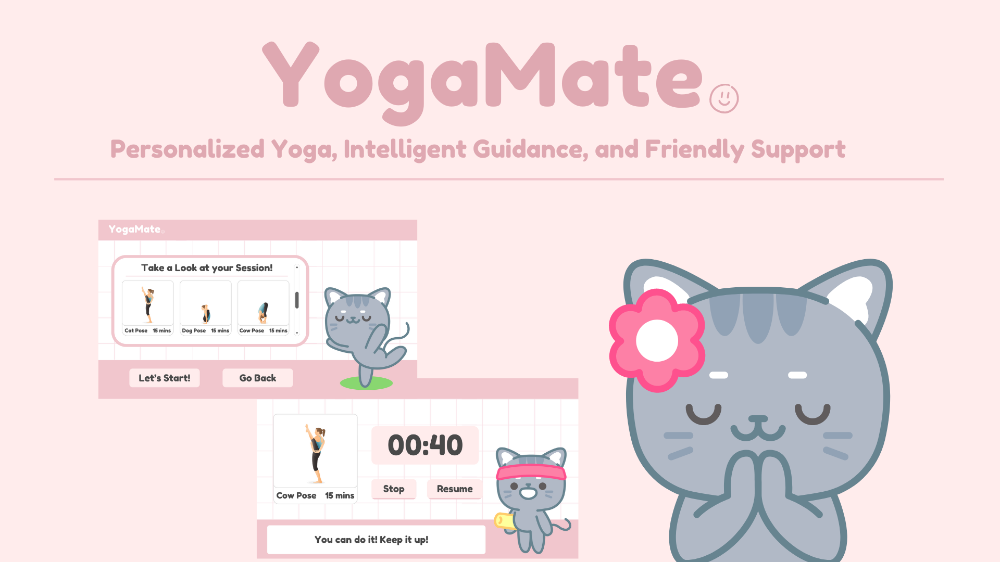
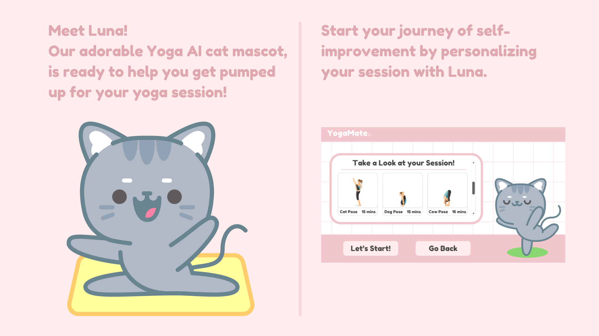
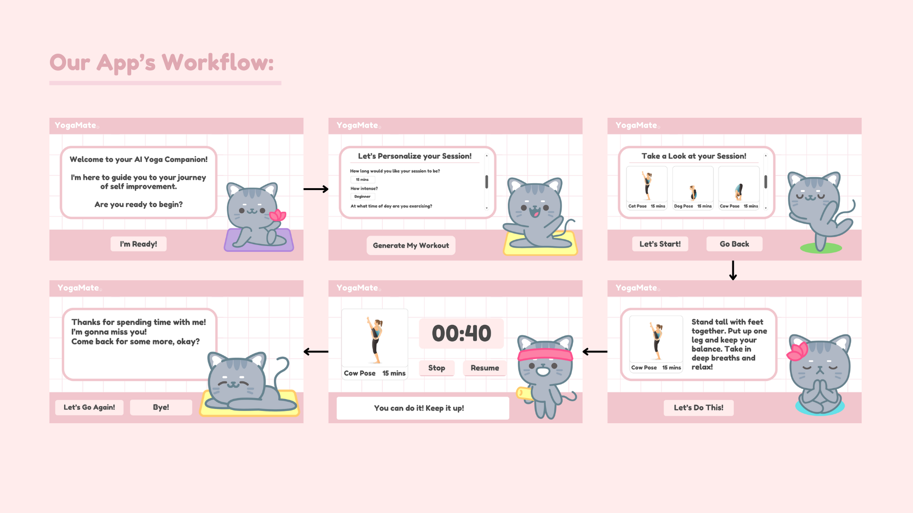
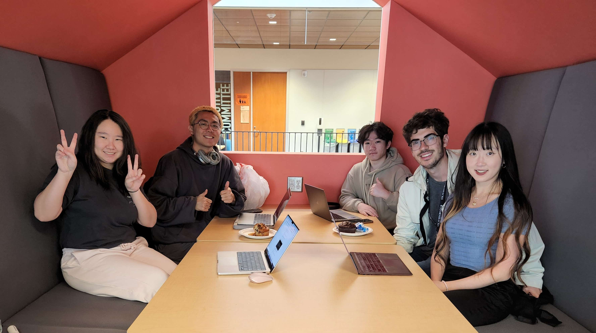

## StormHacks 2024 - YogaMate

## What is YogaMate?
YogaMate is an AI-powered Yoga Fitness App designed to address the challenges of loneliness and fitness in the post-COVID era. It combines personalized yoga plans generated by OpenAI's API with the support of an AI companion to guide users through their fitness journey. It also uses Eleven Labs API to generate audio from the text input that its given to give some personality to our AI Mascot, Luna. By offering tailored yoga sessions and constant encouragement, YogaMate aims to improve both physical and mental well-being while fostering a sense of connection and motivation.

Please refer to [Presentation](https://www.canva.com/design/DAGFn1F8yw8/DbarRYm7PswJVlxY4vPwdg/view?utm_content=DAGFn1F8yw8&utm_campaign=designshare&utm_medium=link&utm_source=editor) and [Design](https://www.canva.com/design/DAGFnD2dYF4/TDbN1ZAK5QgSSLaHL0oNOQ/view?utm_content=DAGFnD2dYF4&utm_campaign=designshare&utm_medium=link&utm_source=editor) and [Devpost](https://devpost.com/software/yogamate?ref_content=my-projects-tab&ref_feature=my_projects) for more detailed information.

## Why did we make YogaMate?
The post-COVID era is plagued with increased loneliness due to social isolation and declining fitness levels stemming from reduced physical activity and unhealthy lifestyles.
- Fitness: Physical inactivity surged, impacting overall health.
- Mental Health: Decline in mental health due to isolation and inactivity.
- Loneliness: Social isolation increased due to lockdowns.

We are creating YogaMate to inspire people to adopt yoga as a way to transform their lifestyles for the better.

## Why Yoga?
Yoga has numerous benefits, including:

- Improved Flexibility
- Increased Strength
- Better Posture
- Enhanced Balance
- Stress Reduction
- Anxiety Relief
- Improved Concentration
- Better Sleep
- Increased Energy Levels
- Pain Relief

## Luna - Our AI Yoga Mascot
Not everyone is always eager to commit to something new and Luna can help encourage people to come and workout with her again! Some people have social anxiety but Luna is cat so it all works out!

## How to Use

1. Clone the repository.
2. Navigate to the project directory.
3. Install the dependencies using `npm install`.
4. Run the application using `npm run dev`.
5. Open your browser and go to `http://localhost:3000` to start your yoga journey.

- Note: When you're running locally, you will need to make sure to have API keys for Open AI API and Eleven Labs API.

## Technologies Used

- Next.js
- React
- Tailwind CSS
- Open AI API
- Eleven Labs API

## Our Amazing Team

